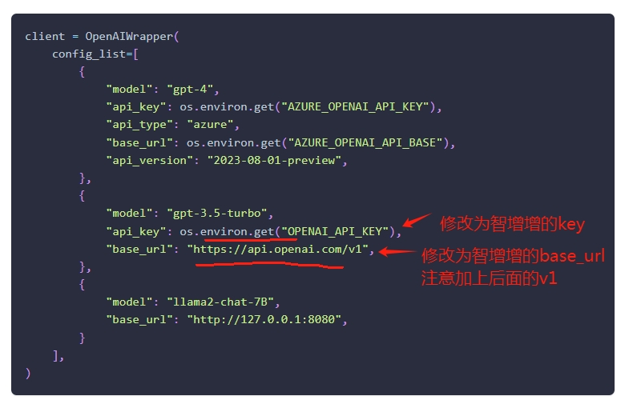
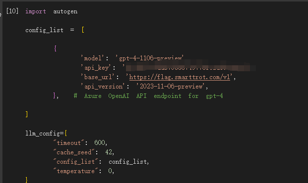

# autogen使用说明

Github地址：[https://github.com/microsoft/autogen](https://github.com/microsoft/autogen)

* 第1步：用手机号登录智增增，获取复制出key和url，地址：[http://gpt.zhizengzeng.com/#/login](http://gpt.zhizengzeng.com/#/login)
* 第2步：打开软件autogen，将上一步复制的key和url填入，即可正常使用。注意配置的主机地址是：`https://flag.smarttrot.com/v1,（注意有个v1）`

示意图，找到如下代码所在位置：

然后设置成智增增的base\_url和key即可：

<figure><figcaption></figcaption></figure>

或者如下设置：

<figure><figcaption></figcaption></figure>
