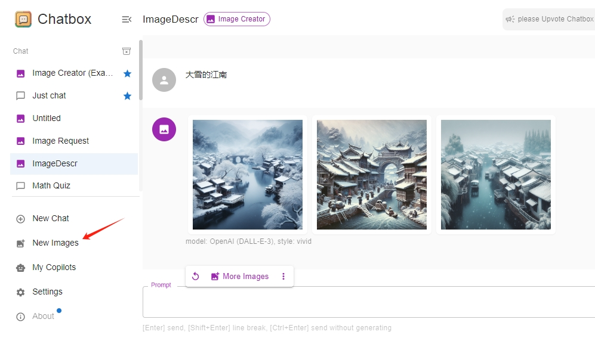

# Chatbox使用指南

## **问：怎么使用？详细的使用步骤是什么？**

**演示视频：**



Chatbox使用截图示意：

<figure><figcaption></figcaption></figure>

简单三步，跟着我一步一步很容易搞定的

* 第1步：需要先下载安装Chatbox

Chatbox这个工具，最好是在自己的电脑下载安装一个软件包来访问，这里是下载地址（请选择适合你的电脑操作系统的版本，windows电脑请下载exe结尾的文件，mac苹果电脑请下载dmg结尾的文件）： [下载地址](https://chatboxai.app/zh#download)

注意，苹果电脑的安装参考这里：[苹果电脑安装说明](https://docs.zhizengzeng.com/ge-ren-shi-yong-shuo-ming/ping-guo-dian-nao-an-zhuang-shuo-ming)

* 第2步：复制智增增密钥。用手机号登录：[http://plugin.smarttrot.com/#/home](http://plugin.smarttrot.com/#/home)，最好在电脑端登录，方便复制密钥。从这里购买密钥，复制出密钥key和主机地址url

<figure><figcaption></figcaption></figure>

* 第3步：设置密钥。打开Chatbox，将上一步复制的密钥key和主机地址url填入，即可正常使用。注意配置的主机地址是：`https://plugin.smarttrot.com`\
  一定要注意：AI模型提供方，选择第2个：OpenAI API

<figure><figcaption></figcaption></figure>

## 问：Chatbox**从哪里下载？怎么访问？**

Chatbox，最好是在自己的电脑下载安装一个软件包来访问，这里是下载地址（请选择适合你的电脑操作系统的版本）： [下载地址](https://chatboxai.app/zh#download)\
当然也可以直接使用网页版（但可能需要代理访问）：[网页访问](https://web.chatboxai.app/)

## 问：还是不会配置怎么办？

最后放上微信交流群，各种AI工具，用好AI工具，可以加入一起交流神奇的用法

<figure><figcaption></figcaption></figure>
