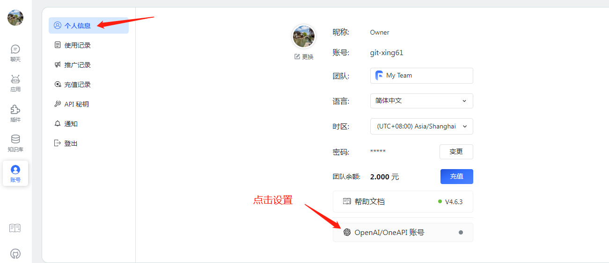
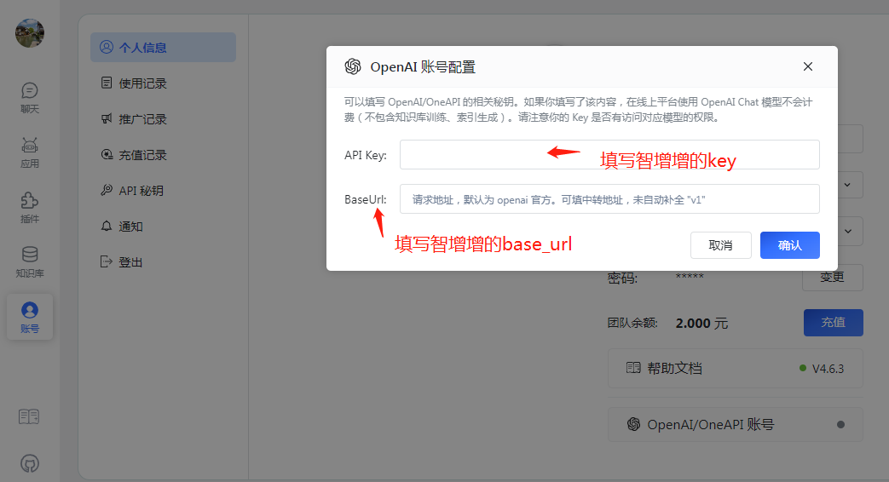

# FastGPT使用说明

Github地址：[https://github.com/labring/FastGPT](https://github.com/labring/FastGPT)

* 第1步：用手机号登录智增增，获取复制出key和url，地址：[http://gpt.zhizengzeng.com/#/login](http://gpt.zhizengzeng.com/#/login)
* 第2步：打开软件FastGPT，将上一步复制的key和url填入，即可正常使用。注意配置的主机地址是：`https://flag.smarttrot.com`

示意图，打开设置页面：

<figure><figcaption></figcaption></figure>

然后设置成智增增的base\_url和key即可：

<figure><figcaption></figcaption></figure>
