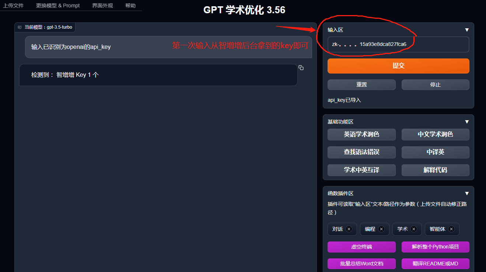

# GPT 学术优化使用指南

## **问：怎么使用？详细的使用步骤是什么？**

**演示视频：**



GPT 学术优化使用截图：



简单三步，跟着我一步一步很容易搞定的

* 第1步：需要先下载安装GPT 学术优化，或者打开这个智增增部署的网页：[GPT 学术优化（智增增版）](http://app.zhizengzeng.com:51666/)

GPT 学术优化这个工具，是一个Github上的开源程序，可以自己安装、或者使用我们智增增部署的版本。官方Github地址： [下载地址](https://github.com/binary-husky/gpt\_academic)，智增增版地址：[打开链接](http://app.zhizengzeng.com:51666/)。

* 第2步：复制智增增密钥。用手机号登录：[http://plugin.smarttrot.com/#/home](http://plugin.smarttrot.com/#/home)，最好在电脑端登录，方便复制密钥。从这里购买密钥，复制出密钥key和主机地址url

<figure><figcaption></figcaption></figure>

* 第3步：配置密钥。打开GPT 学术优化，在第一次使用时，输入上面复制的密钥key即可正常使用。如下图所示：（当然如果要自己安装，需要修改几个地方，参考我们的代码，[Github地址](https://github.com/xing61/zzz\_gpt\_academic)）

<figure><figcaption></figcaption></figure>

## 问：GPT 学术优化**从哪里下载？怎么访问？**

GPT 学术优化这个工具，是一个Github上的开源程序，可以自己安装、或者使用我们智增增部署的版本。官方Github地址： [下载地址](https://github.com/binary-husky/gpt\_academic)，智增增版地址：[打开链接](http://app.zhizengzeng.com:51666/)。

## 问：还是不会配置怎么办？

最后放上微信交流群，各种AI工具，用好AI工具，可以加入一起交流神奇的用法

<figure><figcaption></figcaption></figure>
