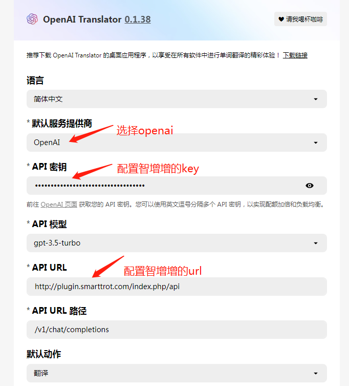

# OpenAI Translator使用指南

## **问：怎么使用？详细的使用步骤是什么？**

**演示视频：**



OpenAI Translator使用截图：

<figure><figcaption></figcaption></figure>



简单三步，跟着我一步一步很容易搞定的

* 第1步：需要先下载安装OpenAI Translator

OpenAI Translator这个工具，是一个浏览器的扩展程序，需要在浏览器里面自己安装一下。官方地址： [下载地址](https://github.com/openai-translator/openai-translator)

* 第2步：复制智增增密钥。用手机号登录：[http://plugin.smarttrot.com/#/home](http://plugin.smarttrot.com/#/home)，最好在电脑端登录，方便复制密钥。从这里购买密钥，复制出密钥key和主机地址url

<figure><figcaption></figcaption></figure>

* 第3步：配置密钥。打开OpenAI Translator，将上一步复制的密钥key和主机地址url填入，即可正常使用。注意配置的主机地址是：`https://plugin.smarttrot.com/`

<figure><figcaption></figcaption></figure>

## 问：OpenAI Translator**从哪里下载？怎么访问？**

OpenAI Translator这个工具，是一个浏览器的扩展程序，需要在浏览器里面自己安装一下。官方地址： [下载地址](https://github.com/openai-translator/openai-translator)

## 问：还是不会配置怎么办？

最后放上微信交流群，各种AI工具，用好AI工具，可以加入一起交流神奇的用法

<figure><figcaption></figcaption></figure>
