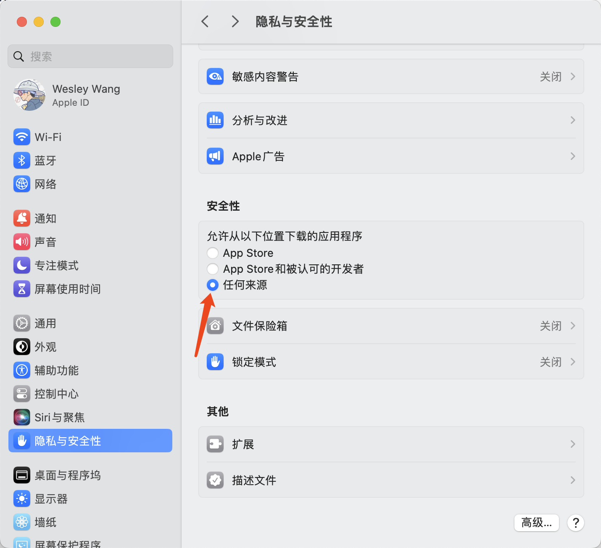

---
layout:
  title:
    visible: true
  description:
    visible: false
  tableOfContents:
    visible: false
  outline:
    visible: true
  pagination:
    visible: false
---

# 苹果电脑安装说明

苹果电脑上安装Chatgpt-next-web

如果提示下面这个：

<figure><figcaption></figcaption></figure>

解决办法：

1、苹果电脑需要“右键”打开

2、同时电脑上要做一下配置：

<figure><figcaption></figcaption></figure>
